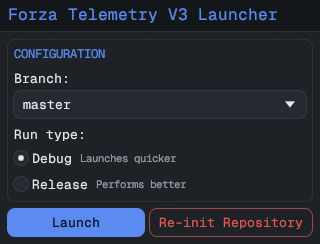

# ForzaTelemetryV3 Launcher

A tiny launcher for [ForzaTelemetryV3](https://github.com/Ritze03/ForzaTelemetryV3).
It keeps a copy of the tool up to date, builds it, and runs it — so you always launch
the latest version with one click. Works on Windows and Linux.



## Get started

### 1. Install the prerequisites

The launcher builds ForzaTelemetryV3 from source, so you need **git** and **Rust** (`cargo`)
on your `PATH`.

**Windows** — install with [winget](https://learn.microsoft.com/windows/package-manager/),
then restart your terminal:

```powershell
winget install Rustlang.Rustup
winget install Git.Git
```

**Linux** — install via your package manager:

```sh
sudo pacman -S rust git        # Arch
sudo apt install cargo git     # Debian/Ubuntu
```

### 2. Download and run the launcher

Grab the binary for your OS from the
[releases page](https://github.com/Ritze03/ForzaTelemetryV3Launcher/releases):

- **Windows** — download `ForzaTelemetryV3Launcher-windows.exe` and double-click it.
- **Linux** — download `ForzaTelemetryV3Launcher-linux`, then `chmod +x` it and run it.

## Using it

1. On start it fetches the latest ForzaTelemetryV3 (first run downloads it — you'll see a
   progress bar).
2. Pick the **branch** you want. Leave it on `master` unless you know you need another.
3. Pick a **run type**:
   - **Debug** — launches quicker.
   - **Release** — performs better.
4. Click **Launch**. It updates, builds (progress bar), then starts ForzaTelemetryV3 and
   closes itself.

Your branch and run type are remembered for next time.

**Re-init Repository** — if a build ever gets stuck or misbehaves, this deletes the local
copy and downloads a fresh one. It's safe: nothing of yours lives there.

> The first build compiles everything and can take a few minutes. After that, launches are
> much faster.

### Skip the menu

Run the launcher with `--last-config` to update, build, and launch your last selection with
no window — handy for a desktop shortcut once you've settled on a branch and run type.

## Where things live

Everything is kept under the OS data dir (`~/.local/share/ForzaTelemetryV3Launcher` on Linux,
`%APPDATA%\ForzaTelemetryV3Launcher` on Windows):

- `repo/` — the ForzaTelemetryV3 copy it builds
- `config.txt` — your last branch + run type
- `run.log` — build & run output (check here if a launch fails)

## Build the launcher from source

```sh
cargo run                                              # debug
cargo build --release                                  # native release
cargo build --release --target x86_64-pc-windows-gnu   # cross-compile to Windows
```
